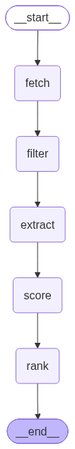
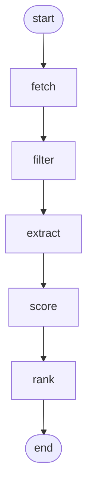

# job-matcher

> Personal AI-powered job pipeline — fetches remote tech roles from multiple sources, extracts skills with DeepSeek, scores by fit against your profile, and streams live progress to a Next.js dashboard.

[](https://github.com/GatoProgramador-01/job-matcher/actions/workflows/ci.yml)
[](https://www.python.org)
[](https://langchain-ai.github.io/langgraph/)

---

## Problem

Job boards are noise. Hundreds of postings per day, most of which don't match your stack, your seniority, or your location constraints. Manual filtering is slow, inconsistent, and doesn't scale to multiple sources simultaneously.

## Solution

A local pipeline that runs on demand: fetch → filter → LLM-extract → score → rank. Every step is a pure LangGraph node. Progress streams to the browser in real time via SSE. Results persist in MongoDB for caching — a job extracted once is never re-billed.

---

## Architecture

### Hexagonal Layers

```
src/job_matcher/
├── domain/              # pure Python — zero infrastructure imports
│   ├── models.py        # Pydantic models: Job, ExtractedJob, ScoredJob, MatcherState
│   ├── ports.py         # Protocol ABCs: JobFetcher, ExtractionCache, RawJobStore
│   └── scoring.py       # pure scoring functions — deterministic, testable, no I/O
├── infrastructure/      # concrete adapters implementing ports
│   ├── mongo.py         # MongoStorage — ExtractionCache + RawJobStore
│   ├── hiring_cafe.py   # Remotive + RemoteOK HTTP fetchers
│   └── deepseek.py      # ChatOpenAI → DeepSeek factory + pricing constants
├── application/
│   └── nodes/           # LangGraph nodes — orchestration only, no business logic
│       ├── fetch.py     # parallel HTTP fetch (ThreadPoolExecutor)
│       ├── filter_.py   # hard filters: remote signal, reject keywords, non-tech titles
│       ├── extract.py   # DeepSeek extraction + MongoDB cache + SSE progress queue
│       ├── score.py     # deterministic scoring via domain.scoring
│       └── rank.py      # sort + top-N output
├── pipeline.py          # compiles the LangGraph StateGraph
├── profile.py           # loads profile.json → ProfileData
└── cli.py               # thin CLI entrypoint
```

### LangGraph Pipeline





| Node | Responsibility | Side effects |
|------|---------------|--------------|
| `fetch` | Parallel HTTP: Remotive + RemoteOK | Saves raw jobs to MongoDB |
| `filter` | Hard discard: reject keywords, non-tech titles, no remote signal | None |
| `extract` | DeepSeek structured extraction with MongoDB cache | Reads/writes `extractions` collection |
| `score` | Deterministic formula (stack + seniority + AI bonus + recency) | None |
| `rank` | Sort descending, take top-N | Saves run metrics to MongoDB |

### SSE Streaming Architecture

```
Browser                   FastAPI /jobs/run          LangGraph pipeline
  │                            │                           │
  │──── POST /jobs/run ──────►│                           │
  │                            │── queue.SimpleQueue ─────►│
  │◄── SSE stream ────────────│   drain via               │── node_start event
  │    node_running            │   run_in_executor         │── job_progress × N
  │    job_progress (×N)       │                           │── node_done event
  │    node_done               │                           │
  │    done                    │◄── sentinel ──────────────│
```

`extract_node` puts per-job events into `SimpleQueue` as each LLM call completes.
FastAPI drains the queue asynchronously via `run_in_executor` without blocking the event loop.

---

## Stack

| Layer | Technology |
|-------|-----------|
| Orchestration | LangGraph 1.2 (StateGraph, pure function nodes) |
| LLM | DeepSeek `deepseek-chat` via LangChain OpenAI adapter |
| Backend API | FastAPI + uvicorn, SSE streaming |
| Database | MongoDB (raw jobs cache, extraction cache, pipeline run metrics) |
| Frontend | Next.js 15 App Router, TypeScript, Tailwind CSS |
| Tests | pytest 37 tests (unit + integration, no network required) |
| CI | GitHub Actions — pytest + tsc + Playwright |

---

## Setup

### Prerequisites

- Python 3.11+
- [uv](https://docs.astral.sh/uv/) — `pip install uv`
- MongoDB (local `mongodb://localhost:27017` or set `MONGODB_URI`)
- DeepSeek API key — [platform.deepseek.com](https://platform.deepseek.com)

### Install

```bash
git clone https://github.com/GatoProgramador-01/job-matcher.git
cd job-matcher
uv sync --extra dev
```

### Configure

```bash
# Secrets
cp .env.example .env
# Set DEEPSEEK_API_KEY in .env

# Your profile
cp profile.example.json profile.json
# Edit profile.json with your stack and search criteria
```

**`.env`**
```env
DEEPSEEK_API_KEY=sk-...
MONGODB_URI=mongodb://localhost:27017   # optional — defaults to local
```

**`profile.json`** (structure)
```json
{
  "name": "Your Name",
  "job_search_criteria": {
    "preferred_keywords": ["Python", "FastAPI", "LangGraph", "TypeScript"],
    "reject_keywords": ["US only", "internship", "Salesforce"],
    "target_seniority": ["mid-level", "semi-senior"],
    "avoid_seniority": ["junior", "trainee"]
  }
}
```

---

## Usage

### CLI

```bash
# Ranked table (default)
uv run job-matcher run

# JSON output — pipe to jq, save to file, etc.
uv run job-matcher run --json

# Custom profile
uv run job-matcher run --profile /path/to/profile.json
```

### API Server

```bash
# Start backend
uv run uvicorn backend.main:app --reload --port 8000

# Start frontend (separate terminal)
cd web && npm install && npm run dev
```

Open [http://localhost:3000](http://localhost:3000) — the Next.js dashboard streams live pipeline progress.

### API Endpoints

| Method | Path | Description |
|--------|------|-------------|
| `POST` | `/jobs/run` | Start pipeline, returns SSE stream |
| `GET`  | `/jobs/health` | Healthcheck |

**SSE event types** (from `POST /jobs/run`):

```
data: {"type": "node_running", "node": "fetch"}
data: {"type": "job_progress", "index": 3, "total": 47, "title": "Senior Python Dev", "skills": ["Python","FastAPI"], "tokens": 312, "cost": 0.000386, "cached": false}
data: {"type": "node_done", "node": "extract"}
data: {"type": "done", "top_jobs": [...], "token_stats": {...}}
```

---

## Scoring Formula

Each job receives a score in the range **[−20, 100]** composed of four additive components:

| Factor | Range | Logic |
|--------|-------|-------|
| Stack overlap | 0 – 40 | Keywords matched: title hit = 3×, body/skills hit = 1×. Normalized to 40 pts. |
| Seniority fit | −20 – +20 | mid/semi-senior = +20 · senior = +10 · junior/intern/trainee = −20 |
| AI/LLM bonus | 0 – 20 | Tier A (LangGraph, RAG, multi-agent, Anthropic) = +20 · Tier B (OpenAI, LLM, ML) = +10 |
| Recency | 0 – 20 | Posted today = 20 · ≤3 days = 15 · ≤7 = 10 · ≤14 = 5 · older = 0 |

Hard filters applied before scoring — discarded jobs never reach the LLM:
- Title contains non-tech signal (sales, marketing, recruiter, HR, legal, medical…)
- Profile `reject_keywords` found in text
- No remote/LATAM eligibility signal detected

---

## LangGraph Studio

Visualize and debug the pipeline interactively.

```bash
uv run python scripts/langgraph_dev.py
```

Then open:

```
https://smith.langchain.com/studio/?baseUrl=http://127.0.0.1:2024
```

You can run the pipeline, inspect node inputs/outputs, replay runs, and trace state transitions at each step.

To regenerate the graph PNG after node changes:

```bash
uv run python -c "
from src.job_matcher.pipeline import build_pipeline
open('docs/graph.png','wb').write(build_pipeline().get_graph().draw_mermaid_png())
"
```

---

## Testing

```bash
# Full suite (63 tests, no network required — all I/O mocked)
uv run python -m pytest tests/ -v

# Single file
uv run python -m pytest tests/test_score.py -v
```

Test coverage areas:

| File | What it tests |
|------|--------------|
| `test_models.py` | Pydantic model defaults, MatcherState TypedDict with/without progress queue |
| `test_filter.py` | Hard filter rules: reject keywords, non-tech titles, remote eligibility |
| `test_score.py` | Scoring formula: stack overlap, seniority bonuses, AI tier, recency, caps |
| `test_pipeline.py` | Fetcher normalization, dedup, cache roundtrip, extract node SSE events, full offline pipeline |
| `test_evaluators_extraction.py` | skill_overlap Jaccard, seniority/remote/latam exact-match evaluators |
| `test_evaluators_ranking.py` | precision@3: hits, partial hits, misses, edge cases |

---

## Evals (LangSmith)

A three-layer evaluation harness tracks model quality and ranking correctness. See **[docs/evals.md](docs/evals.md)** for the full reference.

| Layer | What it measures | Evaluator | Cost | Frequency |
|---|---|---|---|---|
| 1 — Extraction | Skill Jaccard + seniority/remote/LATAM exact match | Deterministic Python | ~$0.003 | Every PR |
| 2 — Ranking | `precision@3` — are the right jobs in the top 3? | Deterministic Python | ~$0.002 | Every PR |
| 3 — Semantic | Are the top jobs defensible for the profile? | LLM-as-judge (DeepSeek-chat) | ~$0.01 | Nightly |

### Quick start

```bash
# 1. Add LangSmith vars to .env
LANGSMITH_TRACING=true
LANGSMITH_API_KEY=lsv2_pt_...
LANGSMITH_PROJECT=job-matcher

# 2. Upload golden datasets (once)
.venv/Scripts/python.exe evals/upload_datasets.py

# 3. Run Layer 1 — extraction accuracy (25 examples, ~12 s)
.venv/Scripts/python.exe evals/run_extraction_eval.py

# 4. Run Layer 2 — ranking quality (5 scenarios, ~5 s)
.venv/Scripts/python.exe evals/run_ranking_eval.py
```

Results appear in LangSmith under **Experiments** as `extraction-*` and `ranking-*`. Layer 3 runs from the LangSmith **Evaluator Playground** — the full prompt is in [docs/evals.md § Layer 3](docs/evals.md#layer-3--llm-as-judge-langsmith-evaluator-playground).

### Datasets

| Dataset | Size | What's in it |
|---|---|---|
| `job-matcher-extraction-v1` | 25 examples | Hand-crafted job postings with known-correct extraction (skills, seniority, remote, LATAM) |
| `job-matcher-ranking-v1` | 5 scenarios | Profile + 8-job batch with expected top-job IDs — stress tests AI bonus, seniority penalties, recency tie-break |

### CI gate

Layers 1 and 2 run automatically on every pull request to `master`. Both scripts exit 1 on regression, blocking the merge.

| Metric | Threshold | Blocks PR |
|---|---|---|
| `skill_overlap` | ≥ 0.75 | yes |
| `seniority_match` | ≥ 0.80 | yes |
| `remote_match` | ≥ 0.90 | yes |
| `latam_match` | ≥ 0.90 | yes |
| `precision_at_3` | = 1.00 | yes |

Required secrets in GitHub → Settings → Secrets: `LANGSMITH_API_KEY`, `DEEPSEEK_API_KEY`.

---

## CI / CD

GitHub Actions runs on every push to `master` and `feat/**`, plus eval checks on every PR:

```
backend  →  pytest 63 tests
evals    →  Layer 1 (extraction) + Layer 2 (ranking) — PR only, exits 1 on regression
frontend →  tsc --noEmit  →  Playwright E2E
```

---

## Project Structure

```
job-matcher/
├── src/job_matcher/     # Python package (hexagonal architecture)
├── backend/             # FastAPI app + SSE router
├── web/                 # Next.js 15 frontend
├── tests/               # pytest suite
├── docs/
│   └── graph.png        # auto-generated LangGraph pipeline topology
├── scripts/
│   └── langgraph_dev.py # LangGraph Studio launcher (Windows pathspec fix)
├── langgraph.json        # LangGraph Studio config
├── pyproject.toml        # Python packaging + tool config
└── .github/workflows/ci.yml
```

---

## Security

- `.env` is gitignored — API keys never committed
- `profile.json` is gitignored — personal data stays local
- `cache.json` is gitignored — local job ID state
- Profile path in API validated against working directory (path traversal prevention)
- MongoDB URI configurable — defaults to local, no credentials in code

---

<details>
<summary>Sprint History</summary>

| Sprint | Date | Delivered |
|--------|------|-----------|
| MVP | 2026-08-11 | CLI pipeline: fetch → filter → extract → score → rank, MongoDB cache, 33 tests |
| Sprint 2A | 2026-08-12 | SSE streaming, `PipelineProgress` frontend card, per-job token/cost tracking, Playwright E2E |
| CI/CD | 2026-08-12 | GitHub Actions: pytest + tsc + Playwright |
| Hexagonal Refactor | 2026-08-12 | domain/ + infrastructure/ + application/ layers, import discipline, 37 tests |
| LangGraph Studio | 2026-08-12 | `langgraph.json`, `scripts/langgraph_dev.py`, `docs/graph.png` |
| Evals + LangSmith | 2026-08-15 | Two-layer eval harness, 30 golden examples, 5 metrics, LangSmith Experiments, Layer 3 LLM-judge prompt, 63 tests |

</details>
