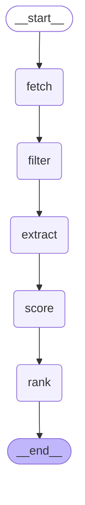

# Design Spec: Real-Time Pipeline Streaming (Sprint 2A) + Hexagonal Refactor

**Date:** 2026-08-12  
**Status:** Approved  
**Branch:** master → feat/pipeline-streaming

---

## Goals

1. **Within-node SSE progress**: emit per-job events from `extract_node` as each LLM extraction completes — title, skills found, tokens used, estimated cost.
2. **Visual progress card**: replace the "Buscando matches..." spinner with a live progress card showing all 5 nodes, a progress bar for `extract_node`, and a running token/cost counter.
3. **Token tracking**: capture per-call token usage via LangChain `get_openai_callback()`. Store a full breakdown (per-job + per-node totals) in `pipeline_runs` MongoDB. Show live totals in the frontend during the run.

---

## Architecture

```
SSE endpoint (jobs.py)
  ├── creates SimpleQueue q
  ├── launches pipeline in daemon thread
  │     └── pipeline.stream() → puts node_start/node_complete events into q
  │         extract_node → _extract_one() per job → puts job_progress into q
  └── drain loop: q.get() → yield SSE event

extract_node
  ├── for each job: _extract_one(job, profile, queue, idx, total)
  │     ├── with get_openai_callback() as cb: extract_job(job, profile)
  │     ├── queue.put({type:"job_progress", index, total, title, skills, tokens, cost})
  │     └── accumulates per_job stats
  └── on node_complete: total tokens + cost saved to pipeline_runs

Frontend (page.tsx + PipelineProgress.tsx)
  ├── SSE onmessage dispatches to pipelineRun state
  ├── node_start  → node = running
  ├── node_complete → node = done + summary
  ├── job_progress → bar advance + title + token counter
  └── done → setJobs() → PipelineProgress unmounts
```

---

## Backend Changes

### `src/job_matcher/models.py`

Add `progress_queue` and `token_stats` to `MatcherState`:

```python
from typing import Any

class MatcherState(TypedDict):
    raw_jobs: list[dict]
    new_jobs: list[Job]
    scored_jobs: list[ScoredJob]
    top_jobs: list[ScoredJob]
    progress_queue: Any        # queue.SimpleQueue | None — None for non-SSE runs
    token_stats: dict          # {node: {tokens, cost, per_job?}}
```

`progress_queue` is always optional — passing `None` (the default) must never raise.

### `src/job_matcher/nodes/extract.py`

Replace the existing parallel loop with `_extract_one` helper:

```python
from langchain_community.callbacks import get_openai_callback

def _extract_one(
    job: Job,
    profile: ProfileData,
    queue: Any,
    idx: int,
    total: int,
) -> tuple[ExtractedJob, int, float]:
    with get_openai_callback() as cb:
        result = extract_job(job, profile)
    tokens = cb.total_tokens
    cost = cb.total_cost
    if queue is not None:
        queue.put({
            "type": "job_progress",
            "index": idx,
            "total": total,
            "title": job.title,
            "skills": result.required_skills,
            "tokens": tokens,
            "cost": cost,
        })
    return result, tokens, cost

def extract_node(state: MatcherState) -> dict:
    jobs = state["new_jobs"]
    profile = load_profile()
    queue = state.get("progress_queue")
    per_job = []
    extractions = []
    total_tokens = 0
    total_cost = 0.0

    with ThreadPoolExecutor(max_workers=4) as pool:
        futures = {
            pool.submit(_extract_one, job, profile, queue, i + 1, len(jobs)): job
            for i, job in enumerate(jobs)
        }
        for future in as_completed(futures):
            result, tokens, cost = future.result()
            extractions.append(result)
            total_tokens += tokens
            total_cost += cost
            per_job.append({
                "title": futures[future].title,
                "tokens": tokens,
                "cost": round(cost, 6),
            })

    token_stats = state.get("token_stats", {})
    token_stats["extract"] = {
        "total_tokens": total_tokens,
        "total_cost": round(total_cost, 6),
        "per_job": per_job,
    }
    return {"extractions": extractions, "token_stats": token_stats}
```

### `backend/routers/jobs.py`

Replace the single `pipeline.invoke()` call with a queue-drained SSE loop:

```python
import queue as q_module
import threading
import json

async def stream_jobs(request: Request):
    progress_q = q_module.SimpleQueue()
    pipeline_result: dict = {}
    pipeline_error: list = []

    def run_pipeline():
        try:
            for chunk in pipeline.stream({
                "progress_queue": progress_q,
                "token_stats": {},
            }):
                # emit node-level events derived from LangGraph chunk keys
                for node_name in chunk:
                    progress_q.put({"type": "node_complete", "node": node_name, "data": {}})
        except Exception as e:
            pipeline_error.append(str(e))
        finally:
            progress_q.put({"type": "__sentinel__"})

    thread = threading.Thread(target=run_pipeline, daemon=True)
    thread.start()

    async def event_generator():
        while True:
            try:
                msg = progress_q.get(timeout=60)
            except Exception:
                break
            if msg["type"] == "__sentinel__":
                # build final jobs payload from pipeline result
                # (pipeline_result populated by run_pipeline above)
                yield f"data: {json.dumps({'type': 'done', 'jobs': []})}\n\n"
                break
            yield f"data: {json.dumps(msg)}\n\n"

    return StreamingResponse(event_generator(), media_type="text/event-stream")
```

**Note:** The actual rank/jobs payload assembly from the existing `jobs.py` is preserved — only the threading wrapper and queue drain are new. The existing `top_jobs` extraction logic moves inside `run_pipeline`.

### `backend/db/mongo.py` — `save_pipeline_run`

Extend the existing `pipeline_runs` document:

```python
def save_pipeline_run(run_id: str, jobs_count: int, token_stats: dict) -> None:
    collection.insert_one({
        "run_id": run_id,
        "created_at": datetime.utcnow(),
        "jobs_returned": jobs_count,
        "token_breakdown": token_stats,   # NEW: {extract: {total_tokens, total_cost, per_job}}
    })
```

---

## Frontend Changes

### `web/src/types/pipeline.ts` (new)

```typescript
export type NodeStatus = 'pending' | 'running' | 'done' | 'error'

export interface PipelineNode {
  name: string
  label: string
  status: NodeStatus
  summary: string | null
}

export interface PipelineRun {
  nodes: PipelineNode[]
  currentJobTitle: string | null
  extractProgress: { done: number; total: number }
  totalTokens: number
  totalCost: number
}
```

### `web/src/components/PipelineProgress.tsx` (new)

Replaces the spinner during pipeline execution. Structure:

```
┌─────────────────────────────────────────────────┐
│  Pipeline en progreso                            │
│                                                  │
│  ✓  Fetch       47 jobs (Remotive 32, ROK 15)  │
│  ✓  Filter      23 nuevos · 24 en cache         │
│  ⟳  Extract    ████████░░░░░░ 8/23              │
│     "Senior Python Dev @ Stripe"                │
│     skills: Python, FastAPI, Docker             │
│  ○  Score       —                               │
│  ○  Rank        —                               │
│                                                  │
│  Tokens: 2,720   Costo: $0.0033   Jobs: 8/23   │
└─────────────────────────────────────────────────┘
```

Props: `run: PipelineRun`

- Node icon: ✓ (done, green) · spinner (running, indigo) · ○ (pending, gray)
- Progress bar: `width: ${(done/total)*100}%` — only visible when `extract` is running
- Token counter: updates on every `job_progress` event
- Current job title + skills: shown while extract is running, cleared on `node_complete`

### `web/src/app/page.tsx` — state additions

```typescript
import type { PipelineRun } from '@/types/pipeline'

const PIPELINE_NODES = ['fetch_node','filter_node','extract_node','score_node','rank_node']
const NODE_LABELS   = ['Fetch','Filter','Extract','Score','Rank']

const [pipelineRun, setPipelineRun] = useState<PipelineRun | null>(null)
```

SSE handler additions (inside existing `onmessage`):

```typescript
if (msg.type === 'node_start') {
  setPipelineRun(prev => updateNode(prev, msg.node, 'running', null))
}
if (msg.type === 'node_complete') {
  setPipelineRun(prev => updateNode(prev, msg.node, 'done', msg.summary ?? null))
}
if (msg.type === 'job_progress') {
  setPipelineRun(prev => prev ? {
    ...prev,
    currentJobTitle: msg.title,
    extractProgress: { done: msg.index, total: msg.total },
    totalTokens: prev.totalTokens + msg.tokens,
    totalCost: prev.totalCost + msg.cost,
  } : prev)
}
if (msg.type === 'done') {
  setJobs(msg.jobs)
  setPipelineRun(null)   // unmounts progress card
}
```

Render — replaces spinner:

```tsx
{pipelineRun && !jobs.length && <PipelineProgress run={pipelineRun} />}
```

Existing results grid, ScoreFilter, pagination, and JobModal are unchanged.

---

## SSE Event Schema

| Event type      | Fields                                                             | Emitted by       |
|-----------------|---------------------------------------------------------------------|------------------|
| `node_start`    | `node: string`                                                     | jobs.py          |
| `node_complete` | `node: string, summary: string`                                   | jobs.py          |
| `job_progress`  | `index: int, total: int, title: str, skills: str[], tokens: int, cost: float` | extract_node via queue |
| `error`         | `message: string`                                                  | jobs.py          |
| `done`          | `jobs: Job[]`                                                       | jobs.py          |

---

## Testing

### Backend (`tests/test_pipeline.py`)

- `test_extract_node_emits_progress_events`: queue receives exactly N `job_progress` events for N jobs
- `test_progress_event_has_required_fields`: each event has `index`, `total`, `title`, `skills`, `tokens`, `cost`
- `test_extract_node_works_without_queue`: `progress_queue=None` runs without error
- `test_token_stats_accumulated_in_state`: after `extract_node`, `token_stats["extract"]["total_tokens"]` > 0

### Frontend E2E (`web/tests/e2e/home.spec.ts`)

- `test_pipeline_shows_progress_card_on_node_start`: mock SSE emits `node_start` → `PipelineProgress` visible
- `test_extract_progress_bar_advances`: 3 `job_progress` events → progress text shows `3/10`
- `test_token_counter_updates_on_job_progress`: after 2 events with 200 tokens each → shows "400"
- `test_progress_card_disappears_on_done`: `done` event → card unmounts, job cards visible

---

## Non-Goals

- No server-side pagination (all jobs already in client memory after SSE completes).
- No streaming from `fetch_node`, `filter_node`, `score_node`, or `rank_node` — these are fast enough that a single `node_complete` event suffices.
- No real-time cost breakdown chart — totals only in the progress card.
- No changes to existing `ScoreFilter`, `JobModal`, or pagination components.

---

## LangGraph Pipeline Graph

Generated with `pipeline.get_graph().draw_mermaid_png()` — saved at `docs/graph.png`.



To regenerate PNG: `uv run python -c "from src.job_matcher.pipeline import build_pipeline; open('docs/graph.png','wb').write(build_pipeline().get_graph().draw_mermaid_png())"`

---

## Architecture: Hexagonal (Ports & Adapters) — added 2026-08-12

```
src/job_matcher/
├── domain/              # pure Python — zero infra imports
│   ├── models.py        # Pydantic models + MatcherState TypedDict
│   ├── ports.py         # Protocol ABCs: JobFetcher, ExtractionCache, RawJobStore
│   └── scoring.py       # pure scoring functions (score_job, _stack_score, ...)
├── infrastructure/      # concrete adapters implementing ports
│   ├── mongo.py         # MongoStorage (ExtractionCache + RawJobStore)
│   ├── hiring_cafe.py   # Remotive + RemoteOK HTTP fetchers (JobFetcher)
│   └── deepseek.py      # make_llm() factory + PRICE_PROMPT/COMPLETION constants
├── application/nodes/   # LangGraph nodes — orchestration only
│   ├── fetch.py         # fetch_node — calls infrastructure.hiring_cafe
│   ├── filter_.py       # filter_node — pure, uses domain.models
│   ├── extract.py       # extract_node — SSE progress queue, calls infra
│   ├── score.py         # score_node — delegates to domain.scoring.score_job
│   └── rank.py          # rank_node — pure sort + print
├── models.py            # backward-compat shim → domain.models
├── fetcher.py           # backward-compat shim → infrastructure.hiring_cafe
├── mongo.py             # backward-compat shim → infrastructure.mongo
├── pipeline.py          # builds LangGraph StateGraph
├── profile.py           # loads profile.json → ProfileData
└── cli.py               # thin entrypoint (all imports at top level)
```

LangGraph Studio config: `langgraph.json` at repo root.
To launch: `npx @langchain/langgraph-cli dev` (requires Node.js 18+).
